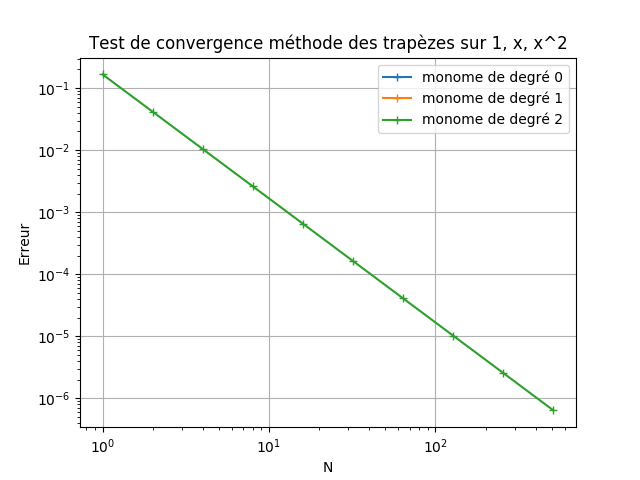
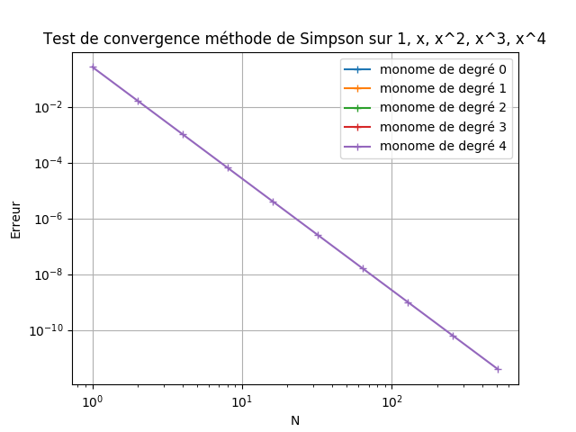
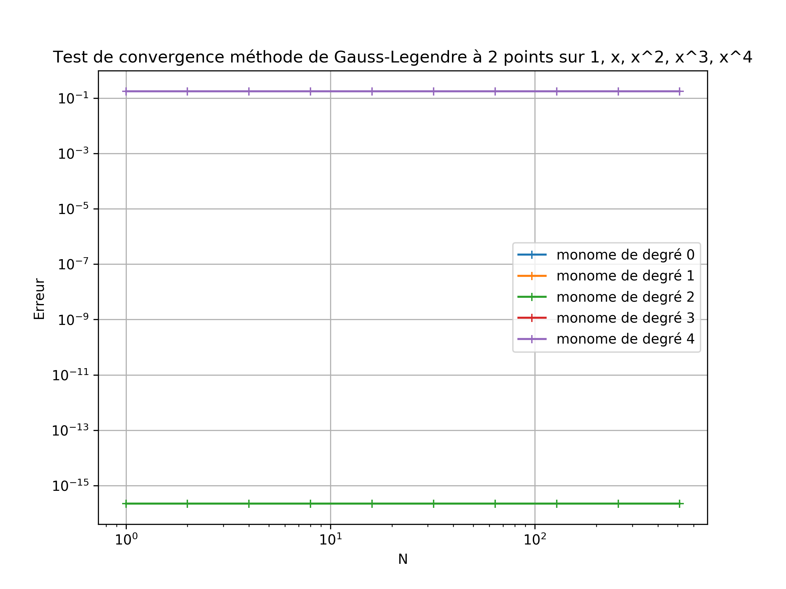
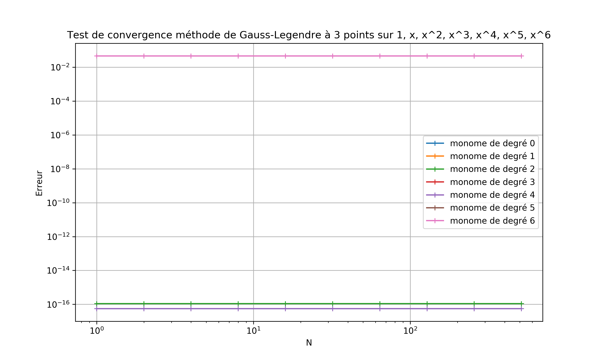
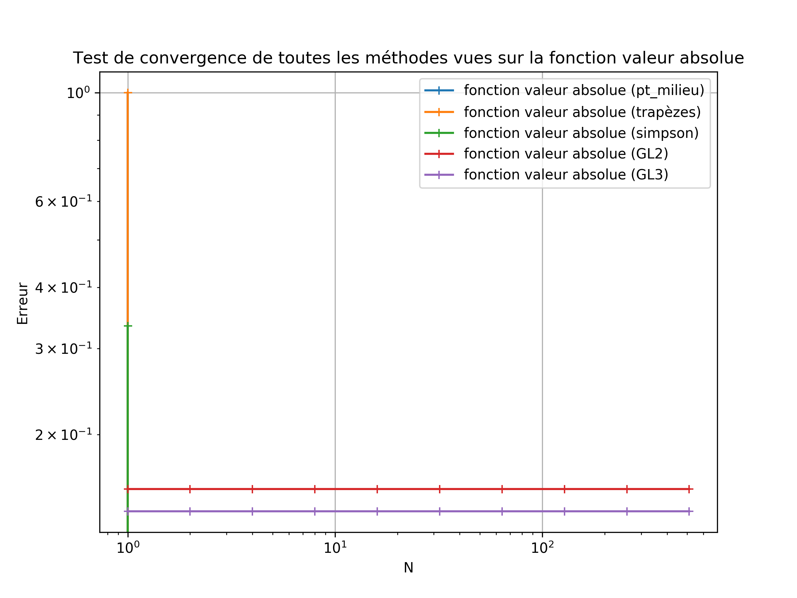
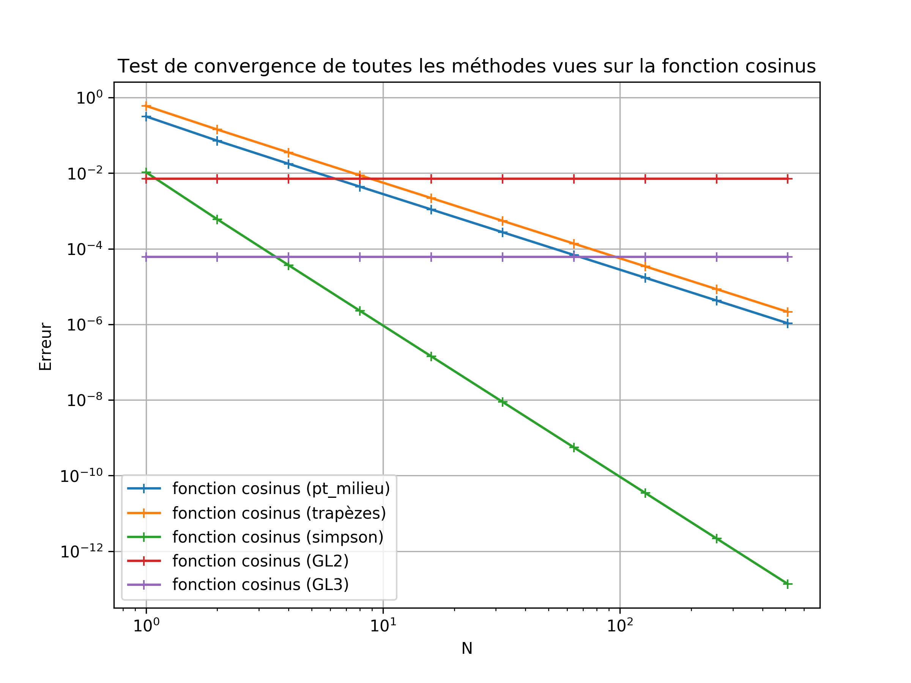
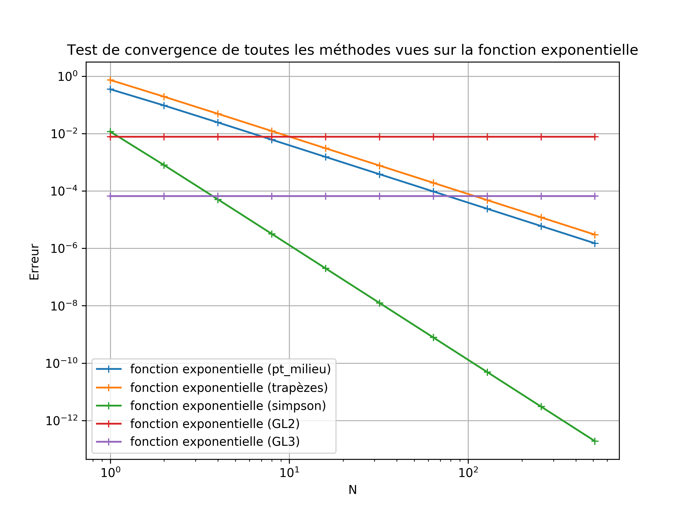
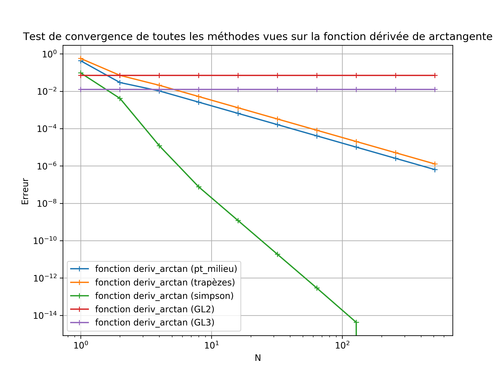

# Première initiation à git, python, markdown en programmant des formules de quadrature en python

## Introduction
Ce fichier fait en même temps office d'énoncé du travail et de compte
rendu. Il doit donc être complété au cours de la séance, au fur et à
mesure que vous réalisez le travail. Les modifications de ce fichier
[./README.md](./README.md) et des fichiers modifiés et ajoutés par
exemple dans les répertoires [./src](./src) ou [./img](./img) doivent
donc être décrit dans l'historique du dépôt git, à travers une série de
*commit* les plus simples possible (dits *atomiques*).

Ce fichier est rédigé, et doit être complété en utilisant le formatage
*markdown*.

Ce travail me permet d'évaluer
- vos capacités initiales de programmation en python
- votre capacité à utiliser un document mathématique pour réaliser un
  programme
- votre capacité à apprendre un nouveau formalisme (*python* et surtout *markdown*)
- vos compétences techniques relatives à l'utilisation de git
- vos capacités à documenter avec un niveau de détail adapté votre
  travail.

*Il n'est pas nécessaire d'aller au bout des questions de programmation
(le niveau de départ en programmation au sein du groupe est très
hétérogène), l'essentiel est que j'ai la possibilité de comprendre quels
sont vos acquis sur les points ci-dessus.*

**À la fin de votre travail, il est donc capital de pousser (*git push*)
  vos modifications sur le serveur, afin que je puisse les voir**

## Avant de commencer
* prenre connaissance, brièvement, du [langage
Markdown](https://guides.github.com/features/mastering-markdown) propre
à la plateforme Github.

Si vous lisez ceci, c'est que vous avez:

- un compte sur la plateforme github.com, et un email validé de
  l'Université (IDNum)

- utilisé le lien déposé sur moodle, et accepté la création automatique
  d'un dépôt git contenant ce répertoire de travail.

## Première partie: environnement de travail et initiation à Python

1. Une fois le dépôt créé, vous le voyez sur votre compte github (en
ligne). Vous pouvez donc récupérer l'adresse et commencer à travailler
(*git clone <url à récupérer en ligne>*).

2. N'oubliez pas de configurer git si nécessaire: *git config --list,
git config --local user.{name,email}* pour regler vos identifiant et
adresse email..

3. Préparez votre environnement de travail: éditeur de texte (*emacs*,
*vim*, *atom*...) et terminaux (terminal par défaut du système, pour git
et pour l'interpréteur *ipython3*), ou bien environnement de
développement intégré (comme *spyder3* ou *pycharm*).

Détaillez ci-dessous votre choix d'environnement de travail et les
raisons de ce choix.

  J'ai choisi de travailler avec un éditeur de texte et deux terminaux. Mon choix
  d'éditeur de texte s'est tourné vers Vscode qui va me permettre de modifier mon
  code ainsi que de "pousser" mes modifications du Copie working vers le staging
  et du staging vers le dépôt. Je vais ensuite utiliser un terminal pour "pousser"
  (push) mes modifications vers le github et actualiser les modifications du github
  sur ma machine ("pull") et un autre terminal pour exécuter mon code avec un
  interpréteur python (ipython3).

4. Puisque vous avez apporté des modifications cohérentes (réponse à la
question 3. ci-dessus), validez ces modifications (*git add* et *git
commit -m "..."*).

5. Familiarisez vous avec le contenu du répertoire, qui devrait
ressembler à :

```
├── README.md
├── img
│   └── test_1.png
├── src
│   ├── fonctions_test.py
│   ├── quadratures.py
│   └── tests.py
└── tex
    ├── memo_quadratures.pdf
    ├── memo_quadratures.tex
```

Quel est la nature (langage ?) et le rôle (texte, programme, autre) de
chacun des fichiers présents ?

  Dans le repository, on a le fichier ReadMe (en markdown) qui introduit et
  explique le projet présent sur le github. On a également une photo(.png), des
  fichiers pythons(.py), un pdf(.pdf) qui est un document permettant de préserver
  et protéger le contenu et la mise en page d'un ordinateur à l'autre et un
  fichier tex(.tex) permettant d'écrire un rapport en Latex (système de
  composition de documents).

**Pensez à valider régulièrement votre travail, et à pousser les
  changements sur le serveur (*git push*) de temps en temps et surtout à
  la fin de la séance de travail**

## Deuxième partie: formules de quadrature

### Exemple: brève analyse de l'ordre de la formule du point milieu
Le programme fournit permet de tester la formule du point milieu sur les
monomes (puissance 0, 1, 2). Les résultats obtenus sont donnés dans le
tableau et le graphe ci-dessous:

n   | erreur x^0 | erreur x^1 | erreur x^2
--- | ---------- | ---------- | ----------
1   |          0 |          0 | 8.333e-02
2   |          0 |          0 | 2.083e-02
4   |          0 |          0 | 51208e-03
8   |          0 |          0 | 1.302e-03
16  |          0 |          0 | 3.255e-04
32  |          0 |          0 | 8.138e-05
64  |          0 |          0 | 2.035e-05
128 |          0 |          0 | 5.086e-06
256 |          0 |          0 | 1.272e-06
512 |          0 |          0 | 3.179e-07


L'erreur est nulle pour l'intégration des fonctions $x^0$ et $x^1$ car
la formule utilisée est exacte pour les polynômes jusqu'au degré 1. La
courbe ne s'affiche donc pas (en échelle logarithmique, $0$ est à
$-\infty$).

Pour la fonction $x^2$, on voit que l'erreur décroit proportionnellement
à $1/n^2$: elle est divisée par 4 à chaque fois que $n$ est multiplié
par 2 (dans le tableau) ou encore est divisée par 10^2 chaque fois que
$n$ est multiplié par 10 (visible sur le graphe). C'est cohérent avec la
théorie pour une formule composée d'ordre 1.

### Programmation et analyse d'autres formules

1. En suivant le modèle de la formule du point milieu, dans le fichier
[./src/quadratures.py](./src/quadratures.py) programmer la méthode des
trapèzes (programmer une autre fonction dans le même fichier
[./src/quadratures.py](./src/quadratures.py)).

2. Tester cette nouvelle quadrature en utilisant comme modèle le
programme [./src/tests.py](./src/tests.py): vérifier que cette formule
calcul de manière exacte les intégrales de polynomes de degré au plus 1,
et commet une erreur équivalente à $h^2$ (ou encore
$N^{-2}$). Reproduire ci-dessous les tableaux d'erreurs qui démontrent
ce résultat, et inclure le graphe de convergence des approximations.

  Le programme `trap(f,a,b,n)` présent dans le fichier python quadratures.py
  permet de tester la formule des trapèzes sur les monomes (puissance 0, 1, 2).
  Les résultats obtenus sont donnés dans le tableau et le graphe ci-dessous :

n   | erreur x^0 | erreur x^1 | erreur x^2
--- | ---------- | ---------- | ----------
1   |          0 |          0 | 1.667e-01
2   |          0 |          0 | 4.167e-02
4   |          0 |          0 | 1.042e-02
8   |          0 |          0 | 2.604e-03
16  |          0 |          0 | 6.510e-04
32  |          0 |          0 | 1.628e-04
64  |          0 |          0 | 4.069e-05
128 |          0 |          0 | 1.017e-05
256 |          0 |          0 | 2.543e-06
512 |          0 |          0 | 6.358e-07



3. On veut tester nos formules pour d'autres fonctions que les
polynômes. Pour cela, on ajoute les fonctions souhaitées dans le fichier
[./src/fonctions_test.py](./src/fonctions_test.py). En suivant le modèle
donné pour les monomes, programmer les fonctions, et une de leurs
primitives
 - $f(x) = |x|$ et $g(x) = 0.5*x*|x|$;
 - $f(x) = cos(x)$ et $g(x) = sin(x)$;
 - $f(x) = exp(x)$ et $g(x) = exp(x)$;
 - $f(x) = 1/(1+x^2)$ et $g(x) = atan(x)$.

4. Produire une unique figure qui compare les graphes de convergence de
l'erreur pour ces nouvelles fonctions integrées sur l'intervalle
$[-1,1]$ avec les méthodes du point milieu et des trapèzes. Insérez
l'image ci-dessous, et faites tous les commentaires utiles.

  Voici la figure comparant les erreurs des différentes méthodes sur l'intervalle
  $[-1,1]$ avec les nouvelles fonctions présentes dans le fichier fonctions_test.py :


  On peut voir que pour la fonction valeur absolue, il y a une grande erreur dans
  le cas où n = 1 pour les deux méthodes.
  D'après la figure, on peut en conclure que la méthode du point milieu est plus
  précise que la méthode des trapèzes.
  Avec ces résultats sous forme de tableau, on perd de la précision. En effet,
  il y a beaucoup d'informations qui se superposent, ce qui rend la lecture
  du graphe difficile.

Pour plus de précision, donnez un tableau comparatif des erreurs commise
pour chacune de ces fonctions pour les deux méthodes.

  Pour la fonction valeur absolue :

n   | erreur pt_milieu  | erreur trapèzes
--- | ----------------- | ---------------
1   |          1        |          1      
2   |          0        |          0      
4   |          0        |          0      
8   |          0        |          0      
16  |          0        |          0
32  |          0        |          0
64  |          0        |          0
128 |          0        |          0
256 |          0        |          0
512 |          0        |          0

  Pour la fonction cosinus :

n   | erreur pt_milieu  | erreur trapèzes
--- | ----------------- | ---------------
1   |    3.171e-01      |     6.023e-01      
2   |    7.222e-02      |     1.426e-01      
4   |    1.766e-02      |     3.521e-02      
8   |    4.391e-03      |     8.774e-03      
16  |    1.096e-03      |     2.192e-03
32  |    2.739e-04      |     5.479e-04
64  |    6.848e-05      |     1.370e-04
128 |    1.712e-05      |     3.424e-05
256 |    4.280e-06      |     8.560e-06
512 |    1.070e-06      |     2.140e-06

  Pour la fonction exponentielle :

n   | erreur pt_milieu  | erreur trapèzes
--- | ----------------- | ---------------
1   |    3.504e-01      |     7.358e-01      
2   |    9.515e-02      |     1.927e-01      
4   |    2.431e-02      |     4.876e-02      
8   |    6.110e-03      |     1.223e-02      
16  |    1.530e-03      |     3.060e-03
32  |    3.825e-04      |     7.651e-04
64  |    9.564e-05      |     1.913e-04
128 |    2.391e-05      |     4.782e-05
256 |    5.977e-06      |     1.195e-05
512 |    1.494e-06      |     2.989e-06

  Pour la fonction derivée de arctangente :

n   | erreur pt_milieu  | erreur trapèzes
--- | ----------------- | ---------------
1   |    4.292e-01      |     5.708e-01     
2   |    2.920e-02      |     7.080e-02      
4   |    1.038e-02      |     2.080e-02      
8   |    2.604e-03      |     5.208e-03      
16  |    6.510e-04      |     1.302e-03
32  |    1.628e-04      |     3.255e-04
64  |    4.069e-05      |     8.138e-05
128 |    1.017e-05      |     2.035e-05
256 |    2.543e-06      |     5.086e-06
512 |    6.358e-07      |     1.272e-06


5. Programmez maintenant la méthode de Simpson et les méthodes de
Gauss-Legendre à 2 et 3 points (voir le document
[./tex/memo_quadratures.pdf](./tex/memo_quadratures.pdf)).

  1) Expliquez la stratégie de programmation retenue.

    Dans les méthodes que nous avons programmées, nous avons mis en place deux
    stratégies de programmation. Dans un premier temps, les formules de Newton-Côtes
    où l'on va grâce à une interpolation polynomiale de la fonction en des points
    répartis uniformément calculer l'intégrale de la fonction. Ces formules
    regroupent la méthode du point milieu, des trapèzes et de Simpson.
    La seconde stratégie consiste à utiliser les formules de Gauss (Gauss-Legendre
    à deux points et à trois points). On choisi cette fois ci des points
    d'interpolations non réguliers sur l'intervalle d'intégration.

  2) Vérifiez numériquement que les formules intègrent exactement les
   polynomes de degré au plus 3 (Simpson, Gauss-Legendre à 2 points) ou 5
   (Gauss-Legendre à 3 points).

    Les formules de Simpson et Gauss-Legendre à 2 points vérifient bien les
    polynomes de degré au plus 3 et la formule de Gauss-Legendre à 3 points
    vérifie bien les polynomes de degré au plus 5 (voir graphes et tableaux
    question 8).

  3) Calculez numériquement l'ordre de convergence de ces méthodes
   (graphes et tableaux).

    Le programme `simpson(f,a,b,n)` présent dans le fichier python quadratures.py
    permet de tester la formule de simpson sur les monomes (puissance 0, 1, 2, 3, 4).
    Les résultats obtenus sont donnés dans le graphe et le tableau ci-dessous:

  

  n   | erreur x^0 | erreur x^1 | erreur x^2 | erreur x^3 | erreur x^4
  --- | ---------- | ---------- | ---------- | ---------- | ----------
  1   |          0 |          0 |         0  |          0 | 2.667e-01
  2   |          0 |          0 |         0  |          0 | 1.667e-02
  4   |          0 |          0 |         0  |          0 | 1.042e-03
  8   |          0 |          0 |         0  |          0 | 6.510e-05
  16  |          0 |          0 |         0  |          0 | 4.069e-06
  32  |          0 |          0 |         0  |          0 | 2.543e-07
  64  |          0 |          0 |         0  |          0 | 1.589e-08
  128 |          0 |          0 |         0  |          0 | 9.934e-10
  256 |          0 |          0 |         0  |          0 | 6.209e-11
  512 |          0 |          0 |         0  |          0 | 3.880e-12


    Le programme `Gauss_Leg_2(f,a,b,n)` présent dans le fichier python
    quadratures.py permet de tester la formule de Gauss-Legendre à 2 points sur
    les monomes (puissance 0, 1, 2, 3, 4). Les résultats obtenus sont donnés dans
    le graphe et le tableau ci-dessous:

  

  n   | erreur x^0 | erreur x^1 | erreur x^2 | erreur x^3 | erreur x^4
  --- | ---------- | ---------- | ---------- | ---------- | ----------
  2   |          0 |          0 | 2.220e-16  |          0 | 1.778e-01


      Le programme `Gauss_Leg_3(f,a,b,n)` présent dans le fichier python
      quadratures.py permet de tester la formule de Gauss-Legendre à 3 points sur
      les monomes (puissance 0, 1, 2, 3, 4, 5, 6). Les résultats obtenus sont donnés
      dans le graphe et le tableau ci-dessous:

  

  n   | erreur x^0 | erreur x^1 | erreur x^2 | erreur x^3 | erreur x^4 | erreur x^5 | erreur x^6
  --- | ---------- | ---------- | ---------- | ---------- | ---------- | ---------- | ----------
  3   |          0 |          0 | 1.110e-16  |          0 | 5.551e-17  |          0 | 4.571e-02


6. On peut maintenant comparer l'ensemble des méthodes programmées, pour
chacune des fonctions de la question 3. Produisez les tableaux et
graphes d'erreurs que vous jugez utile et discutez les résultats
obtenus.

  Voici la figure comparant les erreurs des différentes méthodes d'intégration
  de la fonction f(x) = |x| sur l'intervalle $[-1,1]$.



  Voici la figure comparant les erreurs des différentes méthodes d'intégration
  de la fonction f(x) = cos(x) sur l'intervalle $[-1,1]$.



  Voici la figure comparant les erreurs des différentes méthodes d'intégration
  de la fonction f(x) = exp(x) sur l'intervalle $[-1,1]$.



  Voici la figure comparant les erreurs des différentes méthodes d'intégration
  de la fonction f(x) = 1/(1+x^2) sur l'intervalle $[-1,1]$.




  Pour la fonction valeur absolue :

n   | erreur pt_milieu  | erreur trapèzes  | erreur simpson  | erreur GL2  | erreur GL3
--- | ----------------- | ---------------  | --------------- | ----------- | -----------
1   |          1        |          1       |    3.333e-01    |             |      
2   |          0        |          0       |        0        |  1.547e-01  |      
3   |                   |                  |                 |             |  1.393e-01      
4   |          0        |          0       |        0        |             |      
8   |          0        |          0       |        0        |             |      
16  |          0        |          0       |        0        |             |      
32  |          0        |          0       |        0        |             |      
64  |          0        |          0       |        0        |             |      
128 |          0        |          0       |        0        |             |      
256 |          0        |          0       |        0        |             |      
512 |          0        |          0       |        0        |             |      

  Pour la fonction cosinus :

n   | erreur pt_milieu  | erreur trapèzes  | erreur simpson  | erreur GL2  | erreur GL3
--- | ----------------- | ---------------  | --------------- | ----------- | -----------
1   |    3.171e-01      |     6.023e-01    |    1.059e-02    |             |
2   |    7.222e-02      |     1.426e-01    |    6.022e-04    |  7.118e-03  |
3   |                   |                  |                 |             |  6.158e-05
4   |    1.766e-02      |     3.521e-02    |    3.680e-05    |             |      
8   |    4.391e-03      |     8.774e-03    |    2.287e-06    |             |      
16  |    1.096e-03      |     2.192e-03    |    1.427e-07    |             |
32  |    2.739e-04      |     5.479e-04    |    8.918e-09    |             |
64  |    6.848e-05      |     1.370e-04    |    5.573e-10    |             |
128 |    1.712e-05      |     3.424e-05    |    3.483e-11    |             |
256 |    4.280e-06      |     8.560e-06    |    2.177e-12    |             |
512 |    1.070e-06      |     2.140e-06    |    1.359e-13    |             |

  Pour la fonction exponentielle :

n   | erreur pt_milieu  | erreur trapèzes  | erreur simpson  | erreur GL2  | erreur GL3
--- | ----------------- | ---------------  | --------------- | ----------- | -----------
1   |    3.504e-01      |     7.358e-01    |    1.165e-02    |             |      
2   |    9.515e-02      |     1.927e-01    |    7.924e-04    |  7.706e-03  |
3   |                   |                  |                 |             |  6.546e-05      
4   |    2.431e-02      |     4.876e-02    |    5.063e-05    |             |      
8   |    6.110e-03      |     1.223e-02    |    3.182e-06    |             |      
16  |    1.530e-03      |     3.060e-03    |    1.992e-07    |             |
32  |    3.825e-04      |     7.651e-04    |    1.245e-08    |             |
64  |    9.564e-05      |     1.913e-04    |    7.783e-10    |             |
128 |    2.391e-05      |     4.782e-05    |    4.864e-11    |             |
256 |    5.977e-06      |     1.195e-05    |    3.041e-12    |             |
512 |    1.494e-06      |     2.989e-06    |    1.901e-13    |             |

  Pour la fonction derivée de arctangente :

n   | erreur pt_milieu  | erreur trapèzes  | erreur simpson  | erreur GL2  | erreur GL3
--- | ----------------- | ---------------  | --------------- | ----------- | -----------
1   |    4.292e-01      |     5.708e-01    |    9.587e-02    |             |           
2   |    2.920e-02      |     7.080e-02    |    4.130e-03    |  7.080e-02  |           
3   |                   |                  |                 |             |  1.254e-02        
4   |    1.038e-02      |     2.080e-02    |    1.201e-05    |             |                 
8   |    2.604e-03      |     5.208e-03    |    7.557e-08    |             |                 
16  |    6.510e-04      |     1.302e-03    |    1.182e-09    |             |           
32  |    1.628e-04      |     3.255e-04    |    1.848e-11    |             |           
64  |    4.069e-05      |     8.138e-05    |    2.887e-13    |             |           
128 |    1.017e-05      |     2.035e-05    |    4.219e-15    |             |           
256 |    2.543e-06      |     5.086e-06    |        0        |             |           
512 |    6.358e-07      |     1.272e-06    |        0        |             |           


  On remarque que parmis les formules de Newton-Cotes, la méthode de Simpson est
  la plus précise. On remarque également que les deux méthodes de quadrature de
  Gauss sont plus précises pour les fonctions polynomiales que celles de NC
  mais le sont moins pour celles qui ne les fonctions non polynomiales.


**N'oubliez pas de valider les modifications faites le plus souvent
possible (*validations atomiques*), et de documenter intelligiblement
l'historique associé (les messages). Finalement, n'oubliez pas de
pousser votre travail sur le dépôt.**
